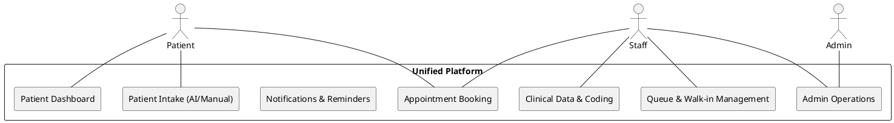
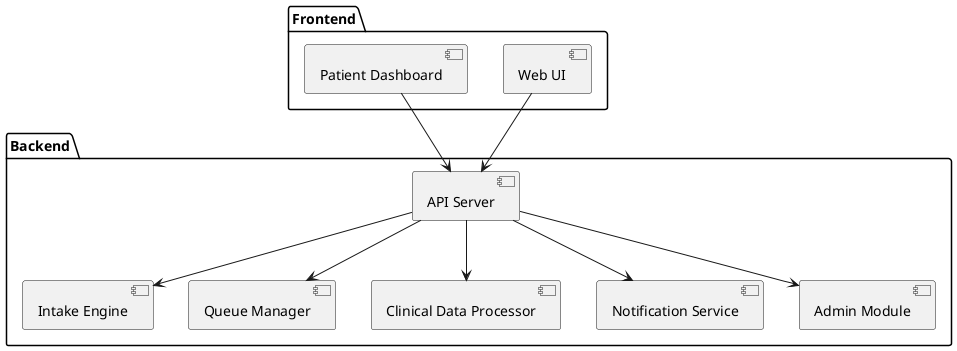
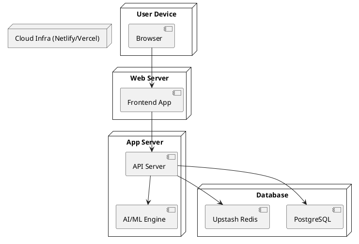
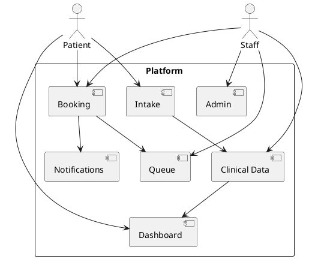
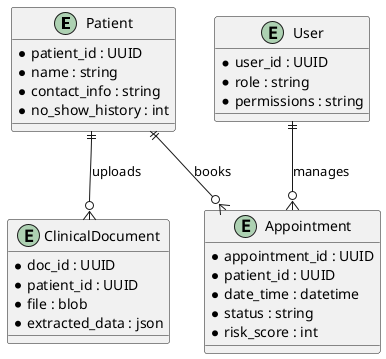
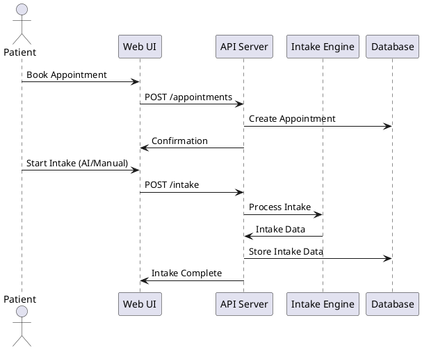

# UML Design Models

## Conceptual Diagram

```plantuml
@startuml
actor Patient
actor Staff
actor Admin
rectangle "Unified Platform" {
  rectangle "Appointment Booking" as Booking
  rectangle "Patient Intake (AI/Manual)" as Intake
  rectangle "Queue & Walk-in Management" as Queue
  rectangle "Clinical Data & Coding" as Clinical
  rectangle "Notifications & Reminders" as Notify
  rectangle "Admin Operations" as AdminOps
  rectangle "Patient Dashboard" as Dashboard
}
Patient -- Booking
Patient -- Intake
Patient -- Dashboard
Staff -- Booking
Staff -- Queue
Staff -- Clinical
Staff -- AdminOps
Admin -- AdminOps
@enduml
```

## Component Diagram

```plantuml
@startuml
package "Frontend" {
  [Web UI]
  [Patient Dashboard]
}
package "Backend" {
  [API Server]
  [Intake Engine]
  [Queue Manager]
  [Clinical Data Processor]
  [Notification Service]
  [Admin Module]
}
[Web UI] --> [API Server]
[Patient Dashboard] --> [API Server]
[API Server] --> [Intake Engine]
[API Server] --> [Queue Manager]
[API Server] --> [Clinical Data Processor]
[API Server] --> [Notification Service]
[API Server] --> [Admin Module]
@enduml
```

## Deployment Diagram

```plantuml
@startuml
node "User Device" {
  [Browser]
}
node "Web Server" {
  [Frontend App]
}
node "App Server" {
  [API Server]
  [AI/ML Engine]
}
node "Database" {
  [PostgreSQL]
  [Upstash Redis]
}
node "Cloud Infra (Netlify/Vercel)" {
}
[Browser] --> [Frontend App]
[Frontend App] --> [API Server]
[API Server] --> [PostgreSQL]
[API Server] --> [Upstash Redis]
[API Server] --> [AI/ML Engine]
@enduml
```

## Data Flow Diagram

```plantuml
@startuml
actor Patient
actor Staff
rectangle "Platform" {
  [Booking]
  [Intake]
  [Queue]
  [Clinical Data]
  [Notifications]
  [Admin]
  [Dashboard]
}
Patient --> [Booking]
Patient --> [Intake]
Patient --> [Dashboard]
Staff --> [Booking]
Staff --> [Queue]
Staff --> [Clinical Data]
Staff --> [Admin]
[Booking] --> [Queue]
[Booking] --> [Notifications]
[Intake] --> [Clinical Data]
[Clinical Data] --> [Dashboard]
@enduml
```

## Entity-Relationship Diagram (ERD)

```plantuml
@startuml
entity "Patient" as PAT {
  * patient_id : UUID
  * name : string
  * contact_info : string
  * no_show_history : int
}
entity "Appointment" as APPT {
  * appointment_id : UUID
  * patient_id : UUID
  * date_time : datetime
  * status : string
  * risk_score : int
}
entity "ClinicalDocument" as DOC {
  * doc_id : UUID
  * patient_id : UUID
  * file : blob
  * extracted_data : json
}
entity "User" as USR {
  * user_id : UUID
  * role : string
  * permissions : string
}
PAT ||--o{ APPT : books
PAT ||--o{ DOC : uploads
USR ||--o{ APPT : manages
@enduml
```

## Sequence Diagram (Booking & Intake)

```plantuml
@startuml
actor Patient
participant "Web UI" as UI
participant "API Server" as API
participant "Intake Engine" as AI
participant "Database" as DB
Patient -> UI : Book Appointment
UI -> API : POST /appointments
API -> DB : Create Appointment
API -> UI : Confirmation
Patient -> UI : Start Intake (AI/Manual)
UI -> API : POST /intake
API -> AI : Process Intake
AI -> API : Intake Data
API -> DB : Store Intake Data
API -> UI : Intake Complete
@enduml
```
